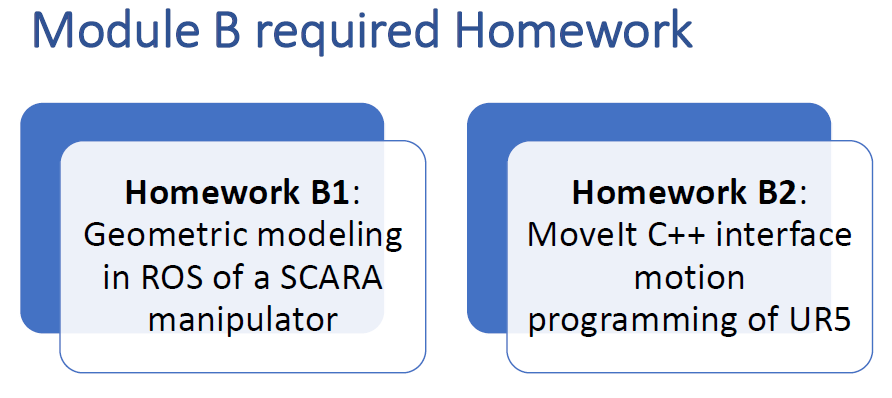

# _Robot Programming and Control (assignments)_




- Use cylinders or boxes to model the different links
- Use different colors at least for horizontal and vertical links
- Neglect the cylindrical base present in the drawing 
- Neglect the gripper present in the drawing

- Implement the direct and inverse kinematic

### Characterization of the SCARA's workspace:


### Introduction:

First of all the URDF was implemented (following along with the ROS tutorial http://wiki.ros.org/urdf/Tutorials/Create%20your%20own%20urdf%20file), accounting for all the required links and joints. The gripper was not neglected, I used the one provided in the URDF ROS official tutorial (http://wiki.ros.org/urdf/Tutorials/Building%20a%20Visual%20Robot%20Model%20with%20URDF%20from%20Scratch). Due to this implementation choice, there are 6 joints in total (2 are used by the end effector).

Then the direct.py and inverse.py scripts were developed. They are used to retrieve the direct or inverse kinematics of the robot's end effector, given the right parameters. In particular the "rosrun" command allows to start the respective ROS node. While the node is running, a service can be launched in order to pass the required parameters, perform the computation and get back the direct/inverse kinematics results.

### SCARA's structure:

### How to launch the _direct kinematics demo_:

```
sh catkin_ws/src/homework_b1/launch/launchDirectKinematics.sh
```

This way, instead of using the "roslaunch" command, a shell script is launched. It allows to open 4 terminals and launch:

- the RViz environment showing the designed SCARA robot
- the direct.py script to compute direct kinematics
- a terminal explaining how to launch the directKinematics service (i.e.: rosservice call /directKinematics -- 0.5 -0.2 0.2 0.5 0.35)
- a terminal showing some information about active topics and services

To notice that only 5 joint angles are provided to the directKinematics call. This was done beacause, as can be seen above, the URDF's tree structure has a ramification that isn't taken into account by the used kinematics library (KDL). Beeing right and left gripper parallel, only one of the two should be provided. This is acceptable  because the end effector was kept mainly for visualization porpouses.

### Screenshots of the running demo:

The SCARA's urdf visualization and the joint_state_publisher GUI:

|  |  |
| ------------------------------------------------------------ | ------------------------------------------------------------ |

Minimum and maximum SCARA's extention:

|  |  |
| ------------------------------------------------------------ | ------------------------------------------------------------ |

Direct kinematics computation:


Information about running topics and services:


### How to launch the _inverse kinematics demo_:

```sh
sh catkin_ws/src/homework_b1/launch/launchInverseKinematics.sh  ```
```

Similarly to the previous demo, a shell script is launched. It allows to open 4 terminals and launch:

- the RViz environment showing the designed SCARA robot
- the inverse.py script to compute inverse kinematics
- a terminal explaining how to launch the inverseKinematics service (i.e.: rosservice call /inverseKinematics -- 0.2 0.45 0.36 1)
- a terminal showing some information about active topics and services

### Screenshots of the running demo:


Information about running topics and services:


----


### Introduction:

First of all ur5 installation tutorial was followed: https://github.com/ros-industrial/universal_robot. In particular, the Melodic version was installed on ROS Noetic.

Other important sources are: https://ros-planning.github.io/moveit_tutorials/doc/move_group_interface/move_group_interface_tutorial.html and https://github.com/ros-planning/moveit_tutorials/blob/master/doc/move_group_interface/src/move_group_interface_tutorial.cpp.

### How to launch the _MoveIt C++ interface demo_:

```
sh catkin_ws/src/homework_b2/launch/launchTerminals.sh
```

This way, a shell script is launched. It allows to open 4 terminals and launch:

- the Gazebo environment for ur5 robot
- the MoveIt! environment for ur5 robot
- the RViz environment for ur5 robot
- the move_group_interface_ur5 ROS node

### Screenshots of the running demo:

ur5 planning and execution of the (G.) command:

### 

ur5 planning and execution of the (H.) command. A trajectory is planned and executed, afterwards the green obstacle is added. So, a new collision-free trajectory is planned and executed:

### 

ur5 planning and execution of the (I.) command. A violet object is also attached to the end effector:


